# Terminal etiket tasarımları (ZPL, 4x2" / 100x50 mm, 203 dpi)

Üç etiket de aynı iskeleti kullanır: üstte siyah başlık bandı (etiket türü + depo/şirket),
solda 560 nokta genişliğinde metin ve Code128 barkod sütunu, sağda 7x büyütmeli QR kod.
Zebra ZD230 (203 dpi, 812 x 406 nokta) için tasarlandı; `^CI28` ile Türkçe karakterler basılır.

| Etiket | Kaynak | Code128 içeriği | QR içeriği | Terminalde nasıl çözülür |
|---|---|---|---|---|
| Ürün | `DOPSWHS Print Dispatcher.BuildItemZpl` | Madde No. | Madde No. | Varsayılan kural → Ürün |
| Raf | `DOPSWHS Print Dispatcher.BuildBinZpl` | Bin Code | Bin Code | Ekran bağlamına göre raf |
| Palet / LP | `DOPSWHS LP Label.BuildZpl` (rapor 72xxx) | SSCC varsa SSCC, yoksa LP No. | Her zaman LP No. | `LP` + rakam → LP; 18 hane → SSCC |

## Ürün etiketi


- Madde No. sütuna sığacak en büyük puntoda (72'den başlar, uzun kodlarda küçülür).
- Açıklama AL tarafında kelime sınırından **iki satıra** bölünür; fazlası kesilir (`^FB` üçüncü satırı ikincinin üstüne basıyordu).
- BİRİM (Base Unit of Measure) ve varsa GTIN.
- Barkod modül genişliği veri uzunluğuna göre 3 → 2 → 1 seçilir; 22 karaktere kadar sol sütunda kalır.

Uzun kod ve uzun açıklama: 

## Raf etiketi


- Bin kodu koridordan okunacak büyüklükte (110 punto, 9 karaktere kadar; daha uzun kodlarda otomatik küçülür).
- Bilgi satırı: BÖLGE (Zone Code), TİP (Bin Type Code), Bin açıklaması.
- Başlık bandının sağında Location Code.

Uzun bin kodu: 

## Palet / LP etiketi


- LP No. büyük; ilk ürün satırı (madde + açıklama), LOT ve varsa "+N DİĞER SATIR", palet miktarı 44 punto.
- Ürünsüz LP'de miktar yerine "BOŞ TAŞIYICI" yazar.
- Alt satır: oluşturma tarihi/saati, ağırlık, boyutlar, oluşturan kullanıcı (boş alanlar atlanır).
- Stop sonrası SSCC üretildiyse Code128 SSCC taşır; QR her durumda LP No. taşır.

SSCC'li örnek: 

## Basım yolları

- Ürün: terminal **Ürün Sorgu → Etiket Yazdır** (`items({no})/printLabel`), ZPL yazıcı yoksa PDF belge yazıcısına düşer (EMU 1.14.105+).
- Raf: terminal **Raf Sorgu → Etiket Yazdır** (`bins(...)/printLabel`).
- LP: LP kartı / terminal LP ekranı **Etiket Yazdır** (`PrintLPLabel`).

Madde Tanımlama Etiketi (MTE) için formatı **yazıcı belirler** (`PrintPalletItemLabels`):

- **ZPL etiket yazıcısı** (sahadaki Zebra, 4×2 inç rulo): `BuildPalletItemZpl`
  ile ürün grubu başına bir ZPL MTE. Terminal MTE'yi önce cihazın **Etiket**
  yazıcısına gönderir; bu, 1.14.1.36'ya kadar sahada basılan etiketin aynısıdır.
- **PDF belge yazıcısı**: `DOPSWHS MTE LP Report` ile onaylı 10×8 cm RDLC
  düzeninde PDF. Her LP ayrı sayfadır; madde, lot, miktar ve QR o LP'nin güncel
  kayıtlarından doldurulur. Bu yol yalnız cihazda Etiket yazıcısı seçili
  değilken Belge yazıcısı PDF ise (veya BC cihaz eşlemesi PDF yazıcı verirse)
  kullanılır ve yazıcıda 10×8 cm etiket takılı olmasını gerektirir.

1.14.1.37 MTE'yi yalnız PDF yoluna almıştı; sahada Belge yazıcısı tanımlı
olmadığı için terminalde "Yazıcı ayarı tamamlanamadı" hatası çıktı (15 Eyl
2026). 1.14.1.38 ile ZPL yolu geri geldi.

Madde Defteri Girişleri'ndeki **Tüm LP MTE Etiketleri** işlemi, seçili girişlere
bağlı bütün LP'leri tek raporda açar; yalnız ilk LP ile sınırlı değildir.

## Önizleme

`*.zpl` örnek dosyaları Labelary ile render edilebilir:

```bash
curl -s -H 'Accept: image/png' -X POST --data-binary @urun-etiketi.zpl \
  http://api.labelary.com/v1/printers/8dpmm/labels/4x2/0/ -o urun-etiketi.png
```

## EMU / DKÇ: etiket ölçüsü Kurulum'dan (customer/emu, 16 Eyl 2026)

DKÇ'deki Zebra ZD230'a takılı rulo **80 x 40 mm**; buradaki 4x2" tasarımlar o ruloda sağdan ve alttan
kesiliyordu. EMU dalında bütün ZPL etiketler **DOPSWHS Setup → Etiket Rulosu (ZPL)** alanlarındaki ölçüye
göre yerleştirilir (`Label Width (mm)` / `Label Height (mm)`, boş = 80x40). Ölçüyü codeunit 72321
`DOPSWHS Label Canvas` okur; bant yüksekliği, punto boyları, QR büyütmesi, barkod yüksekliği ve satır
sığdırma o ölçüden türetilir. Rulo değişince yalnız iki değer güncellenir, paket gerekmez.

Aynı iskelet her tasarımda: siyah başlık bandı (tür + depo/şirket), solda metin sütunu ve Code128,
sağda sığan en büyük QR ve altında ne taşıdığı.

| Önizleme (80x40) | Tasarım | Kaynak |
|---|---|---|
| 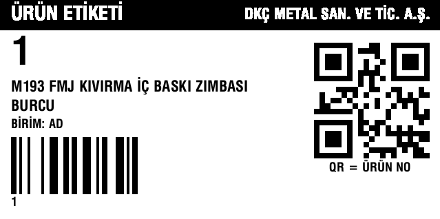 | Ürün etiketi (kısa madde no) | `Print Dispatcher.BuildItemZpl` |
| 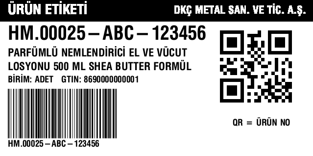 | Ürün etiketi (uzun no, GTIN, 2 satır açıklama) | aynı |
| 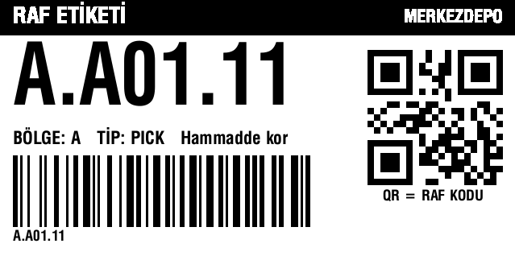 | Raf etiketi | `Print Dispatcher.BuildBinZpl` |
| 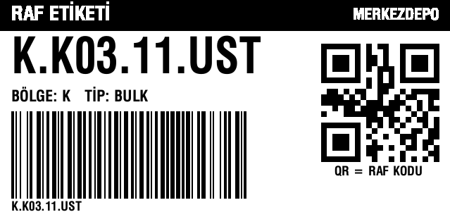 | Raf etiketi (uzun raf kodu) | aynı |
| 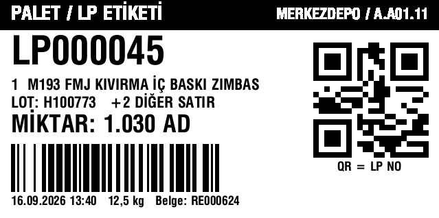 | Standart LP | `LP Label Builder.BuildStandardZpl` |
| 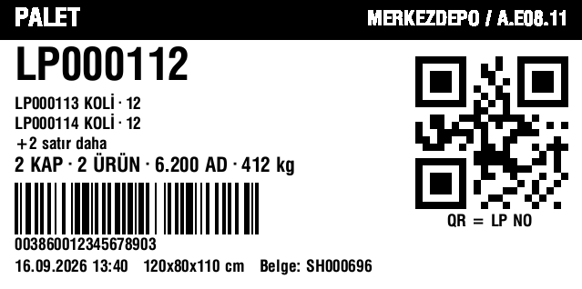 | Palet, içerik listeli, SSCC | `BuildPalletZpl` |
| 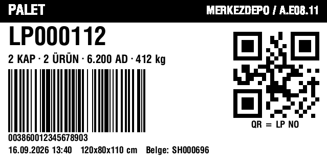 | Palet, yalnız özet | `BuildPalletZpl` |
| 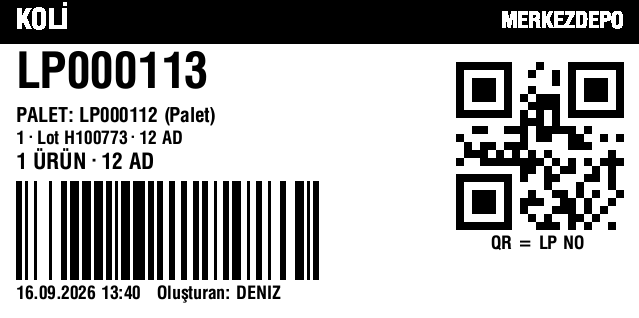 | Koli (üst palet) | `BuildInnerContainerZpl` |
| 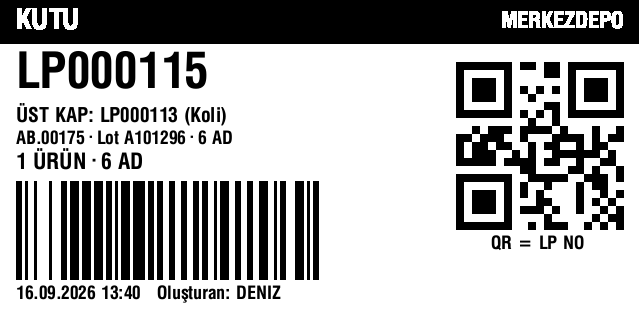 | Kutu (üst kap) | `BuildInnerContainerZpl` |
| 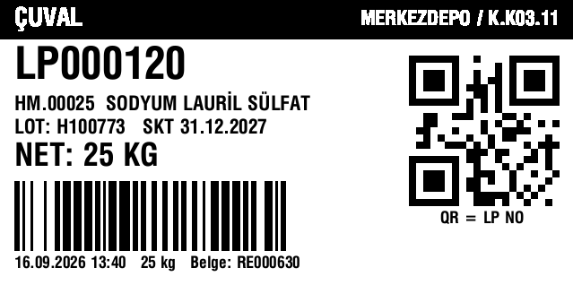 | Çuval (net miktar) | `BuildSackZpl` |
| 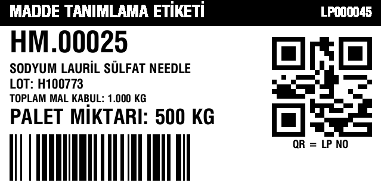 | Palet madde etiketi | `Print Dispatcher.BuildPalletItemZpl` |

Önizleme üretimi: `*.zpl` dosyaları Labelary'de 80x40 mm için `3.15x1.57` boyutuyla render edilir
(`.../8dpmm/labels/3.15x1.57/0/`). LP etiketi şablonun **Kap Türü / Etiket Tasarımı** alanına göre
üretilir; "Etikette İçerik Listelensin" açıkken iç katmanlar listelenir (40 mm etikette en çok 2 satır,
fazlası "+N satır daha"). Ayrıntı: `docs/emu-lp-labels-and-rules.md`, sürüm notu `docs/emu-release-1.14.118.md`.
