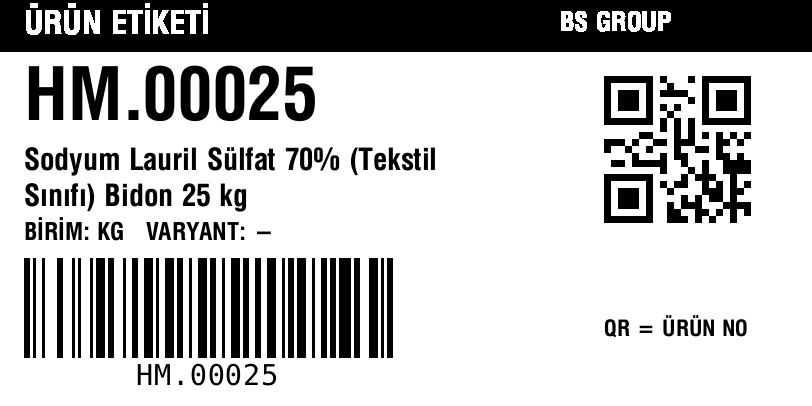
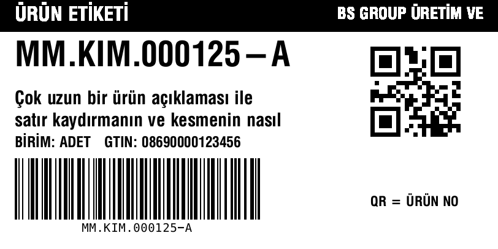
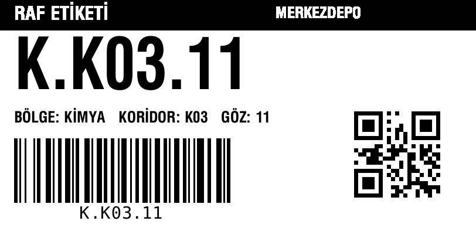
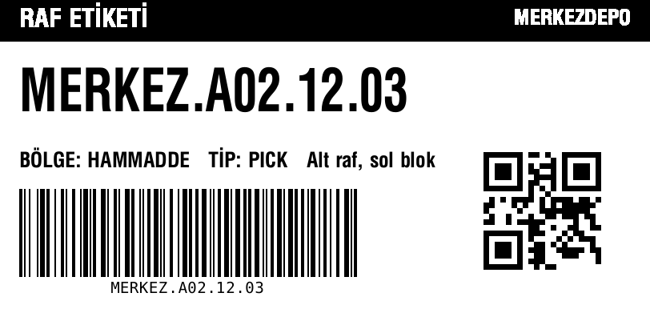
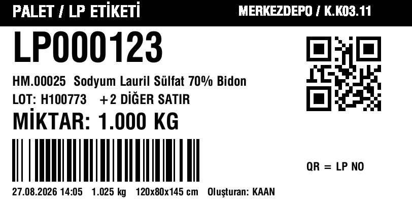
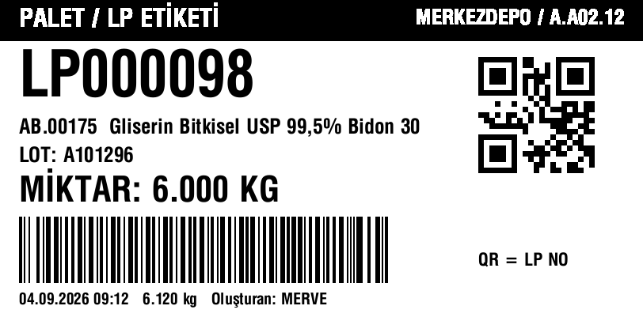

# Terminal etiket tasarımları (ZPL, 4x2" / 100x50 mm, 203 dpi)

Üç etiket de aynı iskeleti kullanır: üstte siyah başlık bandı (etiket türü + depo/şirket),
solda 560 nokta genişliğinde metin ve Code128 barkod sütunu, sağda 7x büyütmeli QR kod.
Zebra ZD230 (203 dpi, 812 x 406 nokta) için tasarlandı; `^CI28` ile Türkçe karakterler basılır.

| Etiket | Kaynak | Code128 içeriği | QR içeriği | Terminalde nasıl çözülür |
|---|---|---|---|---|
| Ürün | `DOPSWHS Print Dispatcher.BuildItemZpl` | Madde No. | Madde No. | Varsayılan kural → Ürün |
| Raf | `DOPSWHS Print Dispatcher.BuildBinZpl` | Bin Code | Bin Code | Ekran bağlamına göre raf |
| Palet / LP | `DOPSWHS LP Label.BuildZpl` (rapor 72xxx) | SSCC varsa SSCC, yoksa LP No. | Her zaman LP No. | `LP` + rakam → LP; 18 hane → SSCC |

## Ürün etiketi



- Madde No. sütuna sığacak en büyük puntoda (72'den başlar, uzun kodlarda küçülür).
- Açıklama AL tarafında kelime sınırından **iki satıra** bölünür; fazlası kesilir (`^FB` üçüncü satırı ikincinin üstüne basıyordu).
- BİRİM (Base Unit of Measure) ve varsa GTIN.
- Barkod modül genişliği veri uzunluğuna göre 3 → 2 → 1 seçilir; 22 karaktere kadar sol sütunda kalır.

Uzun kod ve uzun açıklama: 

## Raf etiketi



- Bin kodu koridordan okunacak büyüklükte (110 punto, 9 karaktere kadar; daha uzun kodlarda otomatik küçülür).
- Bilgi satırı: BÖLGE (Zone Code), TİP (Bin Type Code), Bin açıklaması.
- Başlık bandının sağında Location Code.

Uzun bin kodu: 

## Palet / LP etiketi



- LP No. büyük; ilk ürün satırı (madde + açıklama), LOT ve varsa "+N DİĞER SATIR", palet miktarı 44 punto.
- Ürünsüz LP'de miktar yerine "BOŞ TAŞIYICI" yazar.
- Alt satır: oluşturma tarihi/saati, ağırlık, boyutlar, oluşturan kullanıcı (boş alanlar atlanır).
- Stop sonrası SSCC üretildiyse Code128 SSCC taşır; QR her durumda LP No. taşır.

SSCC'li örnek: 

## Basım yolları

- Ürün: terminal **Ürün Sorgu → Etiket Yazdır** (`items({no})/printLabel`), ZPL yazıcı yoksa PDF belge yazıcısına düşer (EMU 1.14.105+).
- Raf: terminal **Raf Sorgu → Etiket Yazdır** (`bins(...)/printLabel`).
- LP: LP kartı / terminal LP ekranı **Etiket Yazdır** (`PrintLPLabel`).

Madde Tanımlama Etiketi (MTE, `BuildPalletItemZpl`) bilerek değiştirilmedi; BADE sahasında basılan mevcut etiket odur.

## Önizleme

`*.zpl` örnek dosyaları Labelary ile render edilebilir:

```bash
curl -s -H 'Accept: image/png' -X POST --data-binary @urun-etiketi.zpl \
  http://api.labelary.com/v1/printers/8dpmm/labels/4x2/0/ -o urun-etiketi.png
```
